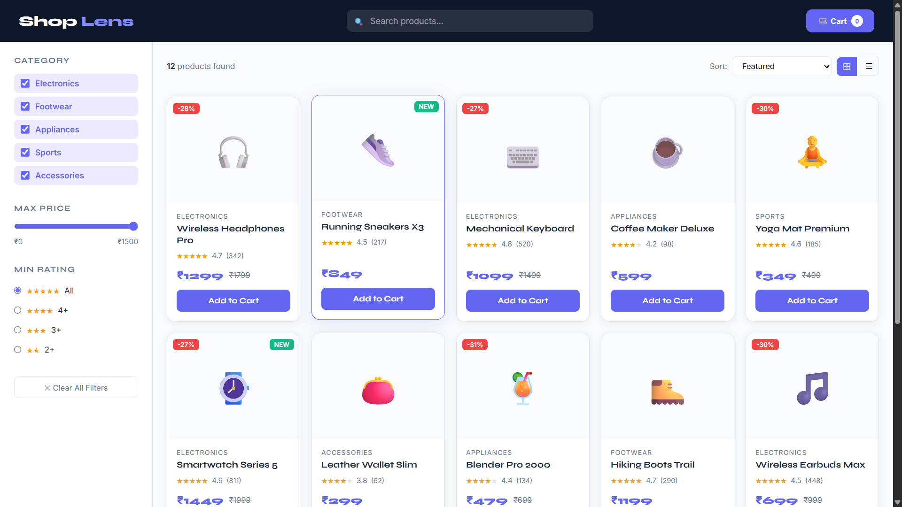
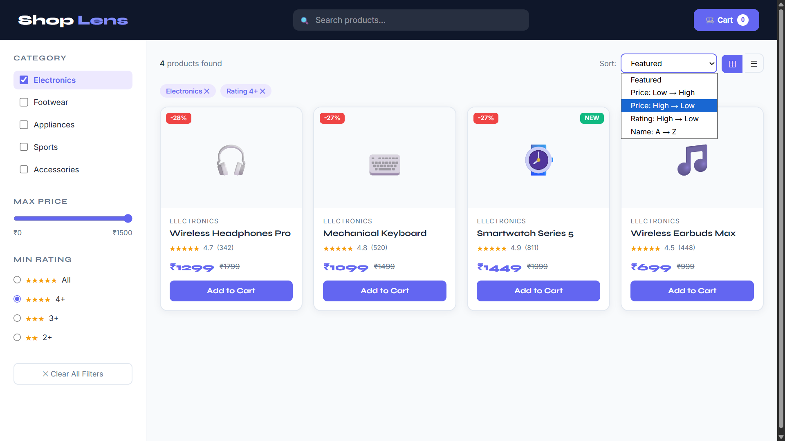

# Product Listing Page

A modern **e-commerce style product listing application** built using **HTML5, CSS3, and Vanilla JavaScript**. The application demonstrates client-side searching, filtering, sorting, responsive layouts, and dynamic user interface updates.

---

## ✨ Features

- 🛍️ Product catalog with multiple categories
- 🔍 Live product search
- 🎯 Category filtering
- 💰 Price range filter
- ⭐ Rating filter
- ↕️ Sort by price, rating, and name
- 🏷️ Grid/List view toggle
- 🛒 Add to Cart functionality
- 🔔 Toast notifications
- 📱 Fully responsive design

---

## 🛠️ Technologies Used

- HTML5
- CSS3
- Vanilla JavaScript (ES6)

---

## 📸 Screenshots

### Homepage



---

### Product Filters & Sorting



---

## 🚀 Live Demo

🌐 https://syed7396.github.io/Product-Listing/

---

## 📁 Folder Structure

```text
Product-Listing/
├── index.html
├── README.md
└── screenshots/
    ├── home.png
    └── filters.png
```

---

## 👨‍💻 Author

**Syed Adnan**

B.Tech – Information Technology  
Sreenidhi Institute of Science and Technology (SNIST)

📧 7989adnan@gmail.com  
🔗 LinkedIn: https://www.linkedin.com/in/syed13/  
💻 GitHub: https://github.com/syed7396
